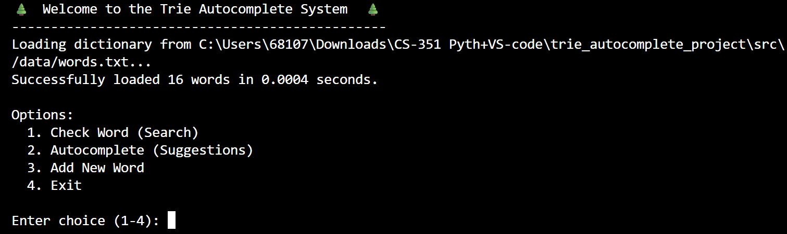
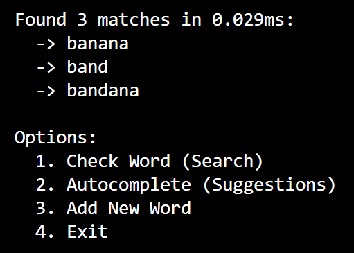
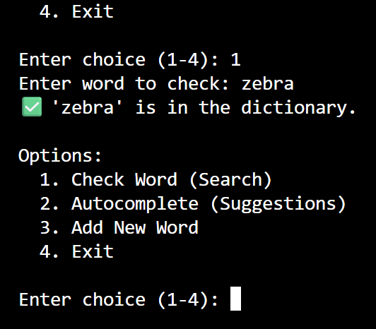

Save this as README.md. You must fill in your name and screenshots.
code Markdown

    
# Trie Autocomplete System 🌲

## Project Overview
This project implements a **Trie (Prefix Tree)** data structure from scratch in Python and utilizes it to power a CLI-based Autocomplete and Spell Checking application. The application demonstrates the efficiency of Tries for string-based operations compared to standard lists.

## Team Members
*   **Evyn Baker** - Solo Developer

## Installation & Setup

### Prerequisites
*   Python 3.6 or higher

### Setup
1. Clone the repository.
2. Navigate to the project directory:
   ```bash
   cd trie_autocomplete_project

  

    Run the application:
    code Bash

        
    python src/app.py

      

Usage Guide

When the application starts, it automatically loads a dictionary of words from data/words.txt.

Available Commands:

    Check Word: Verifies if a specific word exists in the dictionary.

    Autocomplete: input a prefix (e.g., "app") and receive a list of all matching words (e.g., "apple", "apply").

    Add Word: Insert a new word into the runtime memory.

Example Interaction:
code Text

    
Enter choice (1-4): 2
Enter prefix to complete: ban

Found 3 matches in 0.012ms:
  -> banana
  -> band
  -> bandana

  

Screenshots




(Description: The app loading data and showing the main menu)




(Description: Demonstrating the autocomplete suggestion feature)




(Description: Successfully searching for a word)
Tree Implementation Details

The Trie class uses a node-based architecture (TrieNode).

    Structure: Each node contains a dictionary children mapping characters to next nodes, and a boolean is_end_of_word.

    Time Complexity:

        insert: O(L) - proportional to word length.

        search: O(L) - proportional to word length.

        get_suggestions: O(P + N) - proportional to prefix length plus total characters in results.

Evolution of the Interface

During the development process, the interface evolved significantly:

    Initial Design: I only planned for insert and search.

    The Pivot: At first I just had insert and search, but I realized that wasn't enough for autocomplete. I had to figure out how to get all the words under a specific node, so I added the suggestions function.

    Refactoring: I added the get_suggestions method. This required implementing a helper method _dfs (Depth First Search) to recursively collect words once the prefix node was found.

    Refinement: In the original get_suggestions crashed if the prefix didn't exist. I added a check to return an empty list immediately if the prefix path broke.

Challenges & Solutions

    Challenges: Recursion in get_suggestions was tricky to visualize but eventually I figured it out.

    Solution: I drew out the tree on paper for the word "cat" and "car" to understand how the DFS should reconstruct the string by passing current_word + char down the stack (similar to our homework assigngment).

Future Enhancements

    Add a delete method (requires careful handling of nodes with other children).

    Implement frequency tracking to sort suggestions by most common usage.

    Add a GUI using tkinter.